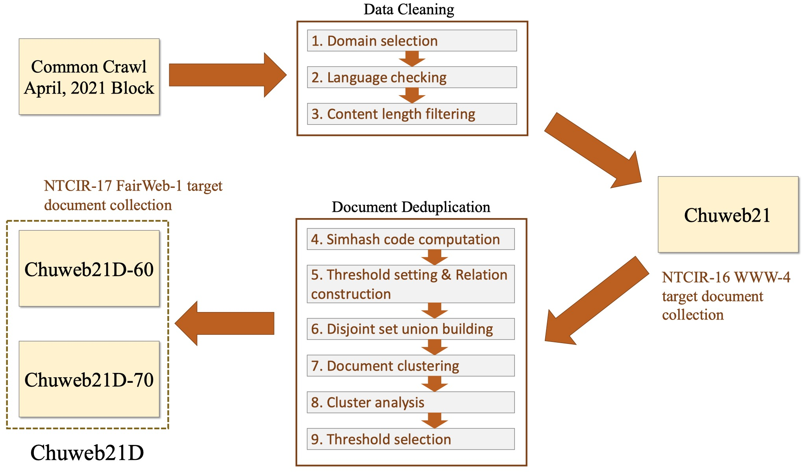

# Chuweb21D: A Deduped English Document Collection for Web Search Tasks
The home page for the public data collections: Chuweb21 and Chuweb21D. You can refer to the paper [Chuweb21D: A Deduped English Document Collection for Web Search Tasks](#) (release soon) for more details of these two collections.

### Background

Chuweb21D is a English document collection deduped from Chuweb21 that was used as the target corpus for the [NTCIR-16 WWW-4 task](http://sakailab.com/www4/). Our motivation for deduping Chuweb21 is based on our experience as the organisers of the NTCIR task: when conducting relevance assessments of the pooled documents for the task, we witnessed considerable amount of duplicate and near-duplicate web pages, which can potentially cause problems.  For deduping, we employ the Simhash strategy with two different clustering thresholds (Hamming distance $\tau \le 2$ and $\tau \le 3$), and release two versions of Chuweb21D;
the smaller collection (Chuweb21D-60) will be used as the target corpus for the upcoming [NTCIR-17 FairWeb-1 (Group-Fair Web Search) task](http://sakailab.com/fairweb1/).

The following figure summarizes the construction procedures of the Chuweb21 and Chuweb21D collection:



### Basic statistics

The following table shows the comparisons between some popular English document collections and our Chuweb21(B) datasets.

| Name             | #Docs     | Space     | Collected time    | Format             |
| ---------------- | --------- | --------- | ----------------- | ------------------ |
| TREC GOV2        | 25M       | 80GB      | Early 2004        | raw html           |
| MS MACRO Docs    | 3.2M      | 22GB      | Before Jan 2017   | text (title; body) |
| Tensorflow c4    | /         | 750GB     | Apr 2019          | text               |
| ClueWeb09        | 1.04B     | 5TB       | Jan 2009~Feb 2009 | raw html           |
| ClueWeb12        | 733M      | 5.54TB    | Feb 2012~May 2012 | raw html           |
| ClueWeb22        | 10B       | /         | Before Aug 2022   | raw html           |
| **Chuweb21**     | **82.5M** | **1.7TB** | **Apr 2021**      | **raw html**       |
| **Chuweb21D-60** | **49.8M** | **1.2TB** | **Apr 2021**      | **raw html**       |
| **Chuweb21D-70** | **57.9M** | **964GB** | **Apr 2021**      | **raw html**       |

### How to download

We have already uploaded Chuweb21 and Chuweb21D-60 to the web disk (Chuweb21D-70 is coming soon!), you can download the data through the shared link, which is listed below:

| Dataset     | Link (Chinese mainland) | Link (others)    | Md5 code |
| ----------- | ----------------------- | ---------------- | -------- |
| Chuweb21    | [Baidu Cloud](https://pan.baidu.com/s/1TusrCeJWe0TPJZUy9mwpYA) (code: t828) | [Google Drive](https://drive.google.com/drive/folders/11hi_R6cSIHEZx3QwyG5KQjgRVmxXhWta) | [md5.txt](https://github.com/chuzhumin98/Chuweb21D/blob/main/materials/md5/md5_checksum-Chuweb21.txt) |
| Chuweb21-60 |  [Baidu Cloud](https://pan.baidu.com/s/1-QKEE0eklYJBLyCLujJXOA) (code: a6j2)  | [TeraBox](https://terabox.com/s/1fZm9SRUiFiDjaKpbzrlPLQ) (code: wtsh) | coming soon! |
| Chuweb21-70 |  coming soon!        | coming soon! | coming soon! |

In addition to web disk download, we also support both hard disk shipping (only for users in Chinese mainland) and server SCP for data delivery. You can contact us via e-mail (thuir_datamanage@126.com) if needed.

### Dataset structure

Both Chuweb21 and Chuweb21D collections are organized as below:

```
data
├── CC-MAIN-XXX     // eight folders (named as time interval), each contains 640 (or 639) warc.gz files                      
│   ├── CC-MAIN-XXX-00000.warc.gz     // warc.gz file which compresses plently of HTML documents
│   └── ... ...
│   └── CC-MAIN-XXX-00639.warc.gz
├── md5_checksum.txt     // md5 codes for each warc.gz

8 directories, 5119 files
```

The HTML documents are organized with "warc.gz" format (an about 70MB sample file: [sample.warc.gz](https://cloud.tsinghua.edu.cn/f/f346492aca5e4b70b827/)). Here we provide a sample Python script to read the "warc.gz" file:

```python
import warc # pip install warc3-wet
import traceback
with warc.open("sample.warc.gz") as f:
    for record in f:
        try:
            url = record['WARC-Target-URI'] # html url
            uid = record['WARC-RECORD-ID']
            uid = uid.replace("<urn:uuid:", "").replace(">", "") # html doc id
            content = record.payload.read() # html content
        except:
            traceback.print_exc()
```

### Authors

E-mail: thuir_datamanage@126.com

Zhumin Chu (Tsinghua University, P.R.C.)

Tetsuya Sakai (Waseda University, Japan)

Qingyao Ai (Tsinghua University, P.R.C.)

Yiqun Liu (Tsinghua University, P.R.C.)